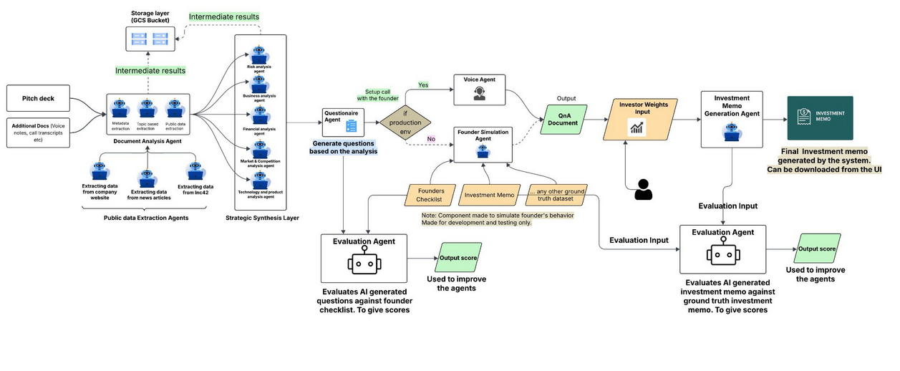

# AI-Shark: Intelligent VC Document Analysis Platform

> A comprehensive multi-phase AI-powered pipeline for venture capital deal analysis, built with React, FastAPI, and Google Gemini LLM.

---

## Overview

**AI-Shark** is an intelligent document analysis platform designed to streamline the venture capital investment process. It automates the extraction, processing, and analysis of pitch decks and related documents, generating comprehensive investment memos through a multi-agent AI system.

The platform transforms what traditionally takes VC analysts 15-30 hours of manual work into an automated, structured workflow that produces consistent, thorough investment analyses.

---

## Key Features

### 🚀 Multi-Phase Analysis Pipeline

1. **Phase 1: Pitch Deck Processing**

    - Uploads and processes pitch decks (PDF/PPT/PPTX)
    - Extracts company metadata, table of contents, and structured content
    - Converts presentations to images for AI analysis
    - Generates structured markdown summaries

2. **Phase 2: Additional Document Processing**

    - Processes supplementary documents (transcripts, emails, updates)
    - Enriches company context with additional information sources
    - Maintains document relationships and references

3. **Phase 3: Multi-Agent AI Analysis**

    - **Business Agent**: Evaluates business model, revenue streams, and scalability
    - **Market Agent**: Analyzes TAM/SAM, competitive landscape, and market trends
    - **Technical Agent**: Assesses technology stack, IP, and technical feasibility
    - **Risk Agent**: Identifies market, execution, financial, and regulatory risks
    - Parallel execution for efficient processing

4. **Phase 4: Founder Response Simulation**

    - Simulates founder responses to investment questionnaires
    - Two modes: Reference-based (using uploaded docs) or Direct Q&A
    - Generates realistic, contextual responses based on company data

5. **Phase 5: Investment Memo Generation**
    - Synthesizes all analysis into a comprehensive investment memo
    - Configurable agent weight templates (Balanced, Market-Focused, Tech-Focused)
    - Exports to Markdown, DOCX, and PDF formats
    - Weighted scoring based on user-defined priorities

### 🎯 Automation Capabilities

-   **80% automation** of initial screening tasks
-   **60% automation** of deep dive analysis
-   **High automation** potential for financial metrics extraction and risk assessment
-   Systematic validation against industry benchmarks
-   Real-time processing with status tracking

### 🧪 Mock Mode for Development & Testing

AI-Shark includes a comprehensive **mock mode** that eliminates the need for LLM API calls during development and testing:

**Benefits:**

-   ⚡ **Instant responses** - No waiting for API calls (perfect for frontend development)
-   💰 **Zero cost** - No API token consumption during testing
-   🔑 **No API keys needed** - Frontend developers can work without credentials
-   📊 **Realistic data** - Returns meaningful mock analysis reports with proper structure
-   🚀 **Full pipeline support** - Works with all endpoints and multi-agent analysis

**How to Enable:**

```bash
# In your .env file
USE_MOCK_LLM=true
```

**What Gets Skipped:**

-   LLM API calls to Google Gemini / Groq
-   PDF/PPT file processing and conversion
-   Returns pre-defined realistic analysis for "TechVenture AI" startup

**Use Cases:**

-   Frontend development without backend dependencies
-   Continuous integration testing
-   Development without API keys
-   Performance testing without rate limits
-   Demonstrating the platform to stakeholders

See the [Mock Mode Documentation](#mock-mode-development) section below for detailed usage.

---

## Architecture Diagram



## Technology Stack

### Frontend

-   **React 18** with TypeScript
-   **Vite** for fast builds and HMR
-   **Material-UI (MUI)** for premium UI components
-   **Redux Toolkit** for state management
-   **React Router** for navigation
-   **Axios** for API communication
-   **React Dropzone** for file uploads

### Backend

-   **FastAPI** (Python 3.11) for REST API
-   **Uvicorn** ASGI server
-   **Pydantic** for data validation
-   **Google Cloud Storage** for file persistence
-   **LangChain** for LLM orchestration
-   **Google Gemini 2.5 Flash** for AI analysis

### Infrastructure

-   **Docker** & **Docker Compose** for containerization
-   **Google Cloud Run** for serverless deployment
-   **Google Cloud Storage (GCS)** for production file storage
-   **Multi-stage Docker builds** for optimized production images

---

## Architecture

### System Design

```
┌─────────────────────────────────────────────────────────────┐
│                        Client Browser                        │
│                      (React SPA + Redux)                     │
└─────────────────────────────────────────────────────────────┘
                              │
                              │ HTTPS
                              ▼
┌─────────────────────────────────────────────────────────────┐
│                   FastAPI Backend (Port 8080)                │
│  ┌──────────────────────────────────────────────────────┐   │
│  │  API Routes                                          │   │
│  │  • /api/v1/documents  (File uploads)                 │   │
│  │  • /api/v1/jobs       (Status polling)               │   │
│  │  • /api/v1/files      (Downloads)                    │   │
│  └──────────────────────────────────────────────────────┘   │
│  ┌──────────────────────────────────────────────────────┐   │
│  │  Services                                            │   │
│  │  • StorageManager    (GCS/Local abstraction)         │   │
│  │  • JobManager        (In-memory job tracking)        │   │
│  └──────────────────────────────────────────────────────┘   │
│  ┌──────────────────────────────────────────────────────┐   │
│  │  Processors                                          │   │
│  │  • PitchDeckProcessor  • AnalysisProcessor           │   │
│  │  • AdditionalDocProcessor  • QAProcessor             │   │
│  │  • FinalMemoProcessor                                │   │
│  └──────────────────────────────────────────────────────┘   │
└─────────────────────────────────────────────────────────────┘
                              │
                    ┌─────────┴─────────┐
                    ▼                   ▼
         ┌──────────────────┐  ┌──────────────────┐
         │  Google Cloud    │  │  Google Gemini   │
         │    Storage       │  │      LLM API     │
         └──────────────────┘  └──────────────────┘
```

### Storage Abstraction

The platform uses a **hybrid storage approach**:

-   **Development**: Local filesystem (`outputs/` directory)
-   **Production**: Google Cloud Storage (GCS) with signed URLs
-   **Automatic detection**: Based on `USE_GCS` environment variable
-   **Seamless switching**: Same API for both storage backends

---

## Getting Started

### Prerequisites

-   **Node.js** 18+ and npm
-   **Python** 3.11+
-   **Docker** and **Docker Compose** (optional)
-   **Google Cloud SDK** (for production deployment)
-   **Google API Key** for Gemini LLM

### Installation

#### 1. Clone the Repository

```bash
git clone https://github.com/yourusername/ai-shark.git
cd ai-shark
```

#### 2. Environment Setup

Create a `.env` file in the project root:

```bash
cp .env.example .env
```

Edit `.env` and add your Google API key:

```env
# LLM Configuration
GOOGLE_API_KEY=your_google_api_key_here
GEMINI_MODEL=gemini-2.5-flash

# Storage Configuration (Development)
USE_GCS=false
OUTPUT_DIR=outputs

# API Configuration
API_PORT=8000

# File Upload
MAX_FILE_SIZE_MB=100
```

#### 3. Backend Setup

```bash
# Install Python dependencies
pip install -e .

# Run FastAPI development server
uvicorn src.api.main:app --reload --port 8000
```

#### 4. Frontend Setup

```bash
cd frontend

# Install dependencies
npm install

# Run Vite development server
npm run dev
```

The application will be available at:

-   **React UI**: http://localhost:3000
-   **FastAPI Backend**: http://localhost:8000
-   **API Documentation**: http://localhost:8000/docs

---

## Docker Deployment

### Development with Docker Compose

Run all services (API, Frontend, and legacy Streamlit):

```bash
docker-compose -f docker-compose.dev.yml up
```

This starts:

-   **FastAPI**: http://localhost:8000
-   **React Frontend**: http://localhost:3000
-   **Streamlit UI** (legacy): http://localhost:8501

### Production Build

Build and run the production container:

```bash
# Build multi-stage Docker image
docker build -f Dockerfile.prod -t ai-shark:latest .

# Run production container
docker run -p 8080:8080 \
  -e USE_GCS=false \
  -e GOOGLE_API_KEY=your_key_here \
  ai-shark:latest
```

Access the application at http://localhost:8080

---

## Cloud Deployment (Google Cloud Run)

### 1. Create GCS Bucket

```bash
gcloud storage buckets create gs://ai-shark-outputs \
  --location=us-central1 \
  --uniform-bucket-level-access
```

### 2. Deploy to Cloud Run

```bash
gcloud run deploy ai-shark \
  --source . \
  --region us-central1 \
  --platform managed \
  --allow-unauthenticated \
  --set-env-vars USE_GCS=true,GCS_BUCKET_NAME=ai-shark-outputs \
  --set-secrets GOOGLE_API_KEY=google-api-key:latest \
  --memory 2Gi \
  --cpu 1 \
  --timeout 600 \
  --max-instances 1
```

### 3. Access Your Deployment

```bash
gcloud run services describe ai-shark --region us-central1 --format='value(status.url)'
```

---

## Usage

### Phase 1: Upload Pitch Deck

1. Navigate to the React UI home page
2. Drag and drop a pitch deck (PDF, PPT, or PPTX)
3. Wait for processing (progress updates every 2 seconds)
4. Review extracted metadata and download generated files

### Phase 2-5: Advanced Analysis

_(Coming soon - currently in development)_

The platform will support:

-   Adding supplementary documents
-   Running multi-agent AI analysis
-   Simulating founder Q&A
-   Generating weighted investment memos with customizable priorities

---

## API Documentation

### Key Endpoints

#### Upload Pitch Deck

```http
POST /api/v1/documents/pitch-deck
Content-Type: multipart/form-data

Response:
{
  "job_id": "uuid-string",
  "message": "Pitch deck uploaded successfully. Processing started."
}
```

#### Check Job Status

```http
GET /api/v1/jobs/{job_id}/status

Response:
{
  "job_id": "uuid-string",
  "status": "completed",
  "progress_message": "Pitch deck processing completed!",
  "result": {
    "success": true,
    "company_name": "Example Corp",
    "files_created": ["Example Corp/pitch_deck.md", ...],
    "metadata": {...}
  }
}
```

#### Download File

```http
GET /api/v1/files/download/{company_name}/{file_path}

Response: File stream or redirect to signed GCS URL
```

Full interactive API documentation is available at `/docs` when running the backend.

---

## Configuration

### Environment Variables

| Variable           | Description              | Default            | Required        |
| ------------------ | ------------------------ | ------------------ | --------------- |
| `GOOGLE_API_KEY`   | Google Gemini API key    | -                  | ✅              |
| `GEMINI_MODEL`     | Gemini model name        | `gemini-2.5-flash` | ❌              |
| `USE_GCS`          | Use Google Cloud Storage | `false`            | ❌              |
| `GCS_BUCKET_NAME`  | GCS bucket name          | `ai-shark-outputs` | Production only |
| `OUTPUT_DIR`       | Local storage directory  | `outputs`          | ❌              |
| `API_PORT`         | FastAPI server port      | `8000`             | ❌              |
| `MAX_FILE_SIZE_MB` | Max upload size (MB)     | `100`              | ❌              |

---

## Development Workflow

### Running Tests

```bash
# Backend tests
pytest tests/

# Frontend tests
cd frontend
npm test

# Integration tests
pytest tests/integration/
```

### Code Quality

```bash
# Python linting
ruff check src/

# TypeScript linting
cd frontend
npm run lint
```

### Building for Production

```bash
# Build React frontend
cd frontend
npm run build

# Build Docker image
docker build -f Dockerfile.prod -t ai-shark:latest .
```

---

## Performance Metrics

### Automation Impact

| Task                         | Traditional Time | AI-Shark Time | Automation % |
| ---------------------------- | ---------------- | ------------- | ------------ |
| Initial Screening            | 1-2 hours        | 5-10 minutes  | **80%**      |
| Deep Dive Analysis           | 4-8 hours        | 1-2 hours     | **60%**      |
| Financial Metrics Extraction | 30-60 minutes    | 2-5 minutes   | **90%**      |
| Risk Flag Detection          | 1-2 hours        | 5-10 minutes  | **85%**      |
| Investment Memo Writing      | 2-4 hours        | 15-30 minutes | **70%**      |

### File Handling

-   **Supported formats**: PDF, PPT, PPTX
-   **Max file size**: 100MB
-   **Processing time**: 30-120 seconds (depending on document size)
-   **Concurrent processing**: Up to 10 jobs simultaneously

---

## License

This project is licensed under the MIT License - see the LICENSE file for details.

---

## Acknowledgments

-   **Google Gemini** for powering the AI analysis
-   **Material-UI** for the premium component library
-   **FastAPI** for the high-performance backend framework
-   **LangChain** for LLM orchestration

---

## Contact & Support

For questions, issues, or feature requests:

-   **GitHub Issues**: [Report a bug](https://github.com/yourusername/ai-shark/issues)
-   **Discussions**: [Join the discussion](https://github.com/yourusername/ai-shark/discussions)

---

**Built with ❤️ for the VC community**
